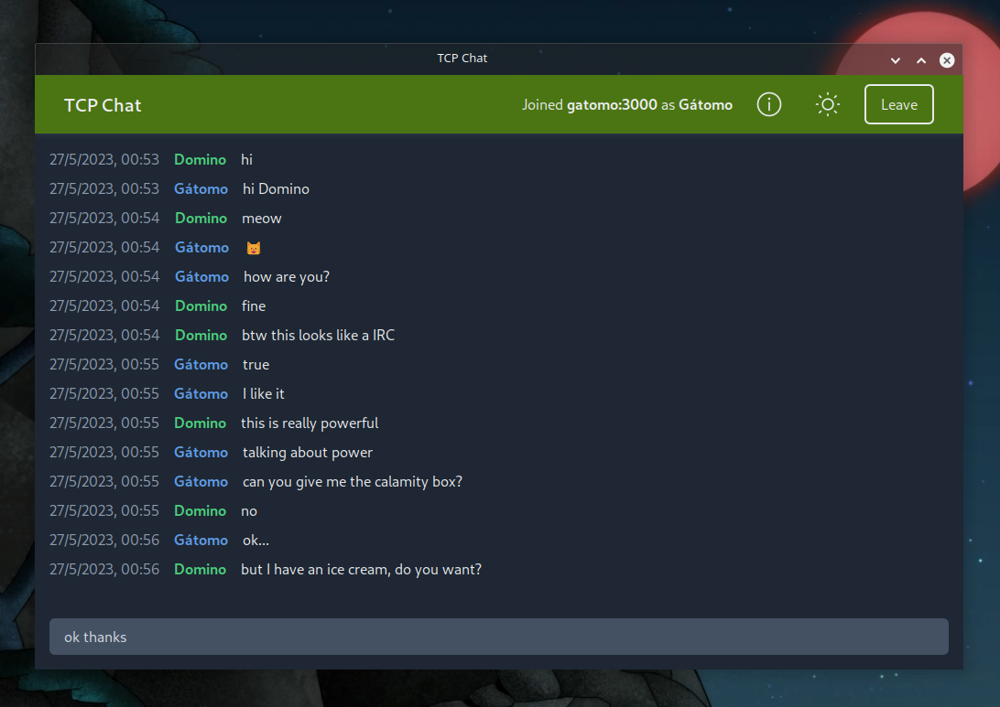

# TCP Chat

Simple, quick and lightweight chat built over TCP and Rust.

</br>



</br>

## Overview

TCP Chat is a simple chat made in Rust with a communication over TCP. The purpose of this project is learn about parallelism and low-level network communication.

This project doesn't want to replace any tool or being a new way to communicate, is just for learn Rust and has several issues (such as non-encrypted packets).

## Stack

### Frontend

-   **Language:** [TypeScript](https://www.typescriptlang.org/), [Rust](https://www.rust-lang.org/es)
-   **Libs:** [Solid](https://www.solidjs.com/), [Tauri](https://tauri.app/), [Vite](https://vitejs.dev/)
-   **Style:** [Tailwind](https://tailwindcss.com/)

### Backend

-   **Language:** [Rust](https://www.rust-lang.org/es)
-   **Libs:** [Tokio](https://tokio.rs/), [Serde](https://serde.rs/)
-   **Protocols:** [TCP](https://www.rfc-editor.org/rfc/rfc793.html)

## Getting started

Since the project is built with Tokio, the standard library and Tauri, TCP Chat is multiplatform.

To start using TCP Chat you need to clone repository, install dependencies and build locally. Client dependencies are managed with [PNPM](https://pnpm.io/), a fast and disk efficient package manager. You can use NPM or Yarn if you want, but I recommend you use PNPM. You can install it with `npm i -g pnpm` and then restarting your terminal.

```bash
# Clone the repo
git clone https://github.com/gatomod/tcp-chat.git

# Build the server
cd tcp-chat

cargo build --release -p server

# Build the client
cd client

pnpm i
pnpm tauri build
```

Then run it

```bash
# Init server
target/release/server

# By default, server is on port 3000
# Add an env variable to edit it
PORT=4848 target/release/server

# Start client
target/release/tcp-chat
```

## How it works?

### The connection
The server opens a TCP Listener. For each new connection spawns a thread and keeps open the connection. At this point, client and server can share the data.

When a connection sends a message, data is sent to server, which shares the packet between all threads and send the message to all connections.

Tauri receives the message and passes it to the web client.

### The "handshake"
TCP Chat has an own protocol to join server and share messages. Those messages are serialized in JSON and are defined at [structs.rs](server/src/structs.rs). All messages have an "op" field (which says the operation to perform) and "data" field (with required data for specified operation). If data is invalid or there are missing fields in "data", server will reply with an error response.

For join, client sends a packet with the proper information to join. Server stores it in a hashmap linking client address and data.

For send a message, client sends a message, the data field will be just the message, without user data. When the server receives it, it'll find the client address in the hashmap and package the user data into the message. Once it's done, message and user data is sent to all connections.

## Troubleshooting

Since TCP Chat is built over Tauri, it could be some issues while building it. Most of theese problems are missing dependencies. I'll add more points as I receive issues with a reasonable solution.

### Linux: Failed to run custom build command for \<x>
Error could be caused due to missing dependencies. Find the name of missing package at line where error says "Perhaps you should add the directory containing \<x>", where "x" is the name of the missing package. Try installing it or updating your system. Some examples of missing packages are `glibc` and `libsoup`.

## Release history

-   1.0.0
    -   Initial release

## License

TCP Chat is licensed under the [GNU General Public License v.3.0](https://www.gnu.org/licenses/gpl-3.0.html).

## Contribute

Any PR is welcome! Is a small project so the guideline is to follow the code style and not make insane purposes.

**_Note:_** _typo errors will be declined._

## Links

**[Web](https://gatomo.ga) - [Donate (via PayPal)](https://paypal.me/gatomooficial) - [Discord](https://discord.gg/E2yBpMq2Km) - [Revolt](https://rvlt.gg/fX4a7k1B)**

_Gátomo - GNU General Public License v.3.0 License_
